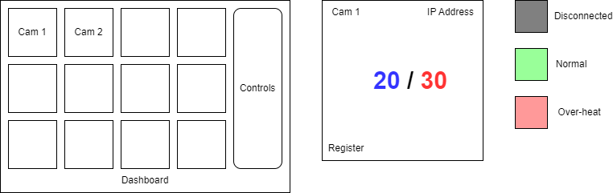

# Camera Dashboard

## Overview

A dashboard to show a collection of Thermal Camera with monitoring functions.

Work of Scope:

* Connect to Thermal Camera NC200 and read Temperature (min, max)
* Forward Temperature values to a Server via Modbus TCP
* When temperature reachs the Threadhold, show a warning

## Development

0. Install Git, Python, Visual Studio Code
   In VSCode, install extensions: Git Graph, Python, Pylance, Pylint, Autopep8, Qt for Python, QML Formatter

1. Clone the repo

    ``` cmd
    git clone https://github.com/vuquangtrong/Camera_Dashboard
    ```

    ``` cmd
    cd Camera_Dashboard
    ```

2. Create a virtual environtment

    ``` cmd
    python -m venv .venv
    ```

    Activate the environtment:

    ``` cmd
    .venv\Scripts\activate.bat
    ```

3. Install requirements

    Install requirements:

    ``` cmd
    pip install -r requirements.txt
    ```

    In details, requirements include: `requests` `pycryptodome` `pymodbus` `pyside6`.

Activate the environtment every time starting the work on new shell/ide:

``` cmd
.venv\Scripts\activate.bat
```

## Technical Notes

* Coding convention

    Follow PEP8 rules at <https://realpython.com/python-pep8/>

* Password encryption

    NC200 uses RSA-PSS, instead of RSA-OAEP, so use `PKCS1_v1_5` cipher.

* Each camera is running in a thread

* For testing, install `flask` to simulate IP-Cam server. Modbus serve is simulated using `pymodbus`.
  
  Simulate IP-Cam:

  ``` cmd
  python simulators\camera.py
  ```

  Simulate Modbus:

  ``` cmd
  python simulators\modbus.py
  ```

## Design

